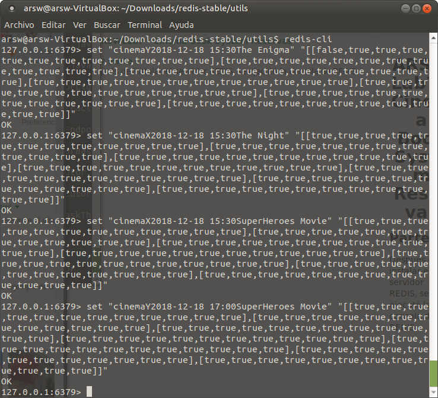
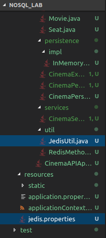
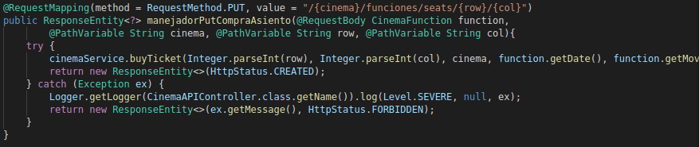
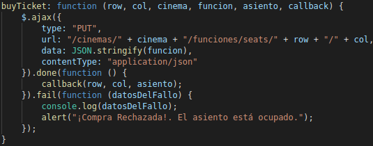
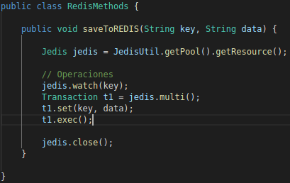

# ARSWLab7 - Cinema Book System Reservas

### Parte I
Después de instalar el servidor REDIS, se guardaron las funciones del archivo redisCinemaInitialKeys.txt en REDIS:
	
	
A continuación se agregaron las dependencias, y la clase jedis util para hacer la conexión con la base de datos, junto con el archivo de propiedades:
	

### Parte 2
Para empezar se configuró la aplicación para que realizara la compra de un asiento, la registrara y la mostrara visualmente.
	
	
	
Para facilitar el manejo de las operaciones sobre REDIS, crearemos diversos métodos utilizando el API DE JEDIS en una clase llamada RedisMethods en el paquete 'util'.

1. Crear el método 'saveToREDIS(key,data)' para guardar un valor en una llave de REDIS:
	
	
2. 
