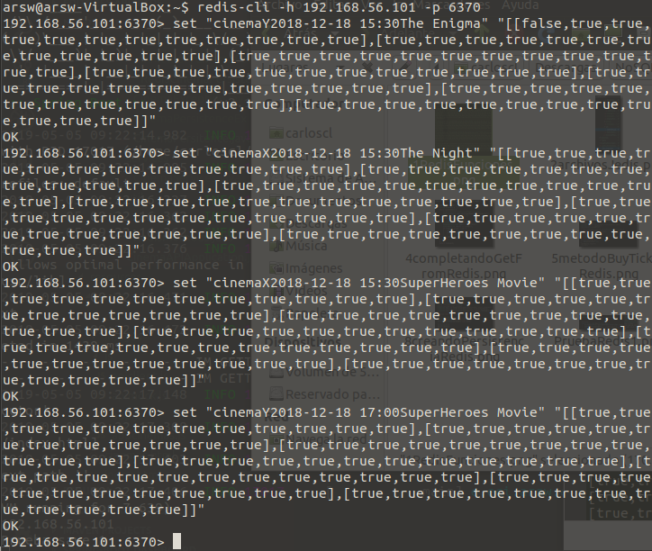

# ARSWLab7 - Cinema Book System Reservas

### Parte I
Después de instalar el servidor REDIS, se guardaron las funciones del archivo redisCinemaInitialKeys.txt en REDIS:
	
	
A continuación se agregaron las dependencias, y la clase jedis util para hacer la conexión con la base de datos, junto con el archivo de propiedades:
	

### Parte 2
Para empezar se configuró la aplicación para que realizara la compra de un asiento, la registrara y la mostrara visualmente.
	
	
	
Para facilitar el manejo de las operaciones sobre REDIS, crearemos diversos métodos utilizando el API DE JEDIS en una clase llamada RedisMethods en el paquete 'util'.

- Crear el método 'saveToREDIS(key,data)' para guardar un valor en una llave de REDIS:
	
	
- Completando el método 'getFromREDIS(key)' para que a través de una llave se retorne su data correspondiente:
	
	
- A continuación se creó el método 'buyTicketRedis' el cual retorna la matriz de booleanos asociada a la llave que representa a la función.
	

- Después se creó el método 'getSeatsRedis' el cual, al igual que 'buyTicketRedis', debe retornar la matriz de booleanos asociada a la llave que representa a la función pero sin modificarla.
	

Ahora se creó una nueva implementación de la clase CinemaPersitence pero llamada 'RedisCinemaPersistence' y se procedió a modificar algunos métodos para que se consulté la información de las funciones en REDIS.

- Se editó el método 'buyTicket' de la clase 'RedisCinemaPersistence' de modo que utilice el método 'buyTicketRedis' creado anteriomente. 
	

- Se editó el constructor de la clase 'RedisCinemaPersistence', para que la data stub que cargue sea actualizada con los datos más recientes del REDIS al momento de iniciar el servidor.
	
